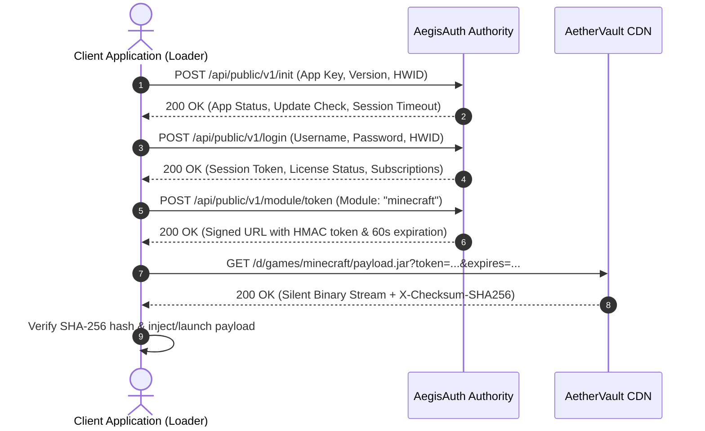

# AegisAuth Examples

Official integration examples for **AegisAuth** — the next-generation authentication, HWID-locking, subscription management, and secure asset licensing authority.

Designed for game loaders, desktop applications, internal tools, and client binaries requiring rock-solid copy protection, session revocation, and secure binary delegation.

---

## ⚡ Supported Languages (15)

Every example is self-contained and demonstrates:
- **Application Initialization (`init`)**: Handshake, version enforcement, and maintenance state check.
- **User Authentication (`login`)**: Credential validation with automatic hardware fingerprinting (HWID).
- **License Key Activation (`license`)**: Machine-locked license keys and multi-subscription checking.
- **Secure Binary Delegation (`module/token`)**: Requesting ephemeral, signed download tokens for AetherVault silent CDN delivery.
- **Session Cleanup (`logout`)**: Secure termination of active sessions.

| Language | Directory | Key Libraries Used |
| :--- | :--- | :--- |
| **C** | [`/c`](./c) | C11 + WinINet / socket REST client |
| **C++** | [`/cpp`](./cpp) | Modern C++ with WinINet + Windows HWID |
| **C# / .NET** | [`/csharp`](./csharp) | .NET 6/7/8 `HttpClient` + `System.Text.Json` |
| **Dart** | [`/dart`](./dart) | Dart `dart:io` + `dart:convert` |
| **Go** | [`/go`](./go) | Go `net/http` + `crypto/sha256` standard library |
| **Java** | [`/java`](./java) | Java 11+ `java.net.http.HttpClient` (zero external dependencies) |
| **JavaScript** | [`/javascript`](./javascript) | Modern Node.js ESM `fetch` |
| **Kotlin** | [`/kotlin`](./kotlin) | Kotlin / JVM `HttpClient` |
| **Lua** | [`/lua`](./lua) | Lua 5.1/5.3/5.4 + `luasocket` / `luasec` |
| **Objective-C** | [`/objc`](./objc) | macOS/iOS `NSURLSession` + Foundation |
| **PHP** | [`/php`](./php) | Native cURL / stream wrappers |
| **Python** | [`/python`](./python) | Python 3 `urllib.request` (zero external dependencies) |
| **Rust** | [`/rust`](./rust) | `reqwest` + `serde` + `tokio` |
| **Swift** | [`/swift`](./swift) | Swift 5.5+ `URLSession` + async/await |
| **TypeScript** | [`/typescript`](./typescript) | Modern typed Node.js client |

---

## 🔑 Configuration & Placeholders

In each example, replace the placeholder constants with your application details:

```text
AUTH_URL        = "https://auth.example.com"    // Your AegisAuth server URL
APP_KEY         = "YOUR_APP_KEY"                // Application Key from the dashboard
APP_NAME        = "My Application"              // Application display name
APP_VERSION     = "1.0.0"                       // Semantic client version
USERNAME        = "YOUR_USERNAME"               // User credentials (or license key)
PASSWORD        = "YOUR_PASSWORD"
```

> [!NOTE]
> All examples use clean, readable placeholder names. Never hardcode live production secrets in public client source repositories.

---

## 🛡️ Authentication & Delivery Lifecycle



---

## 📄 License

Licensed under the [MIT License](./LICENSE).
